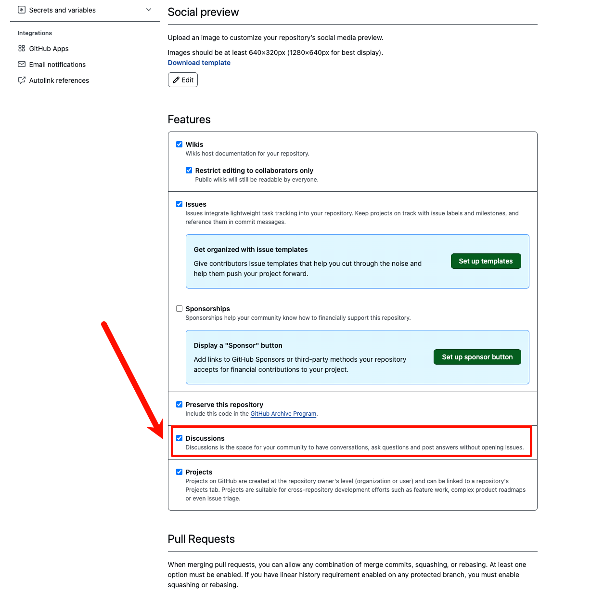
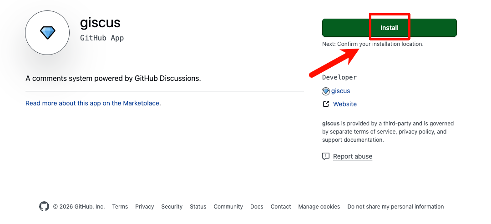
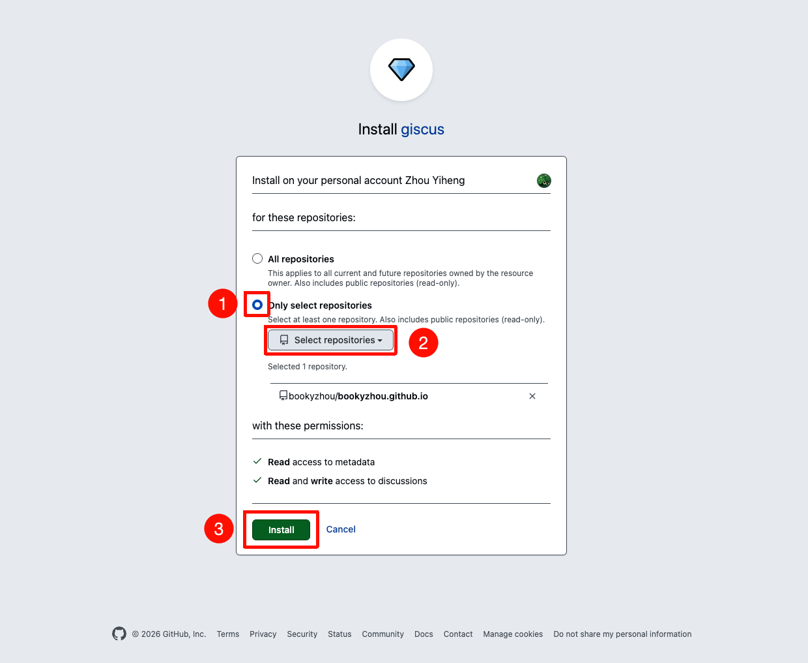
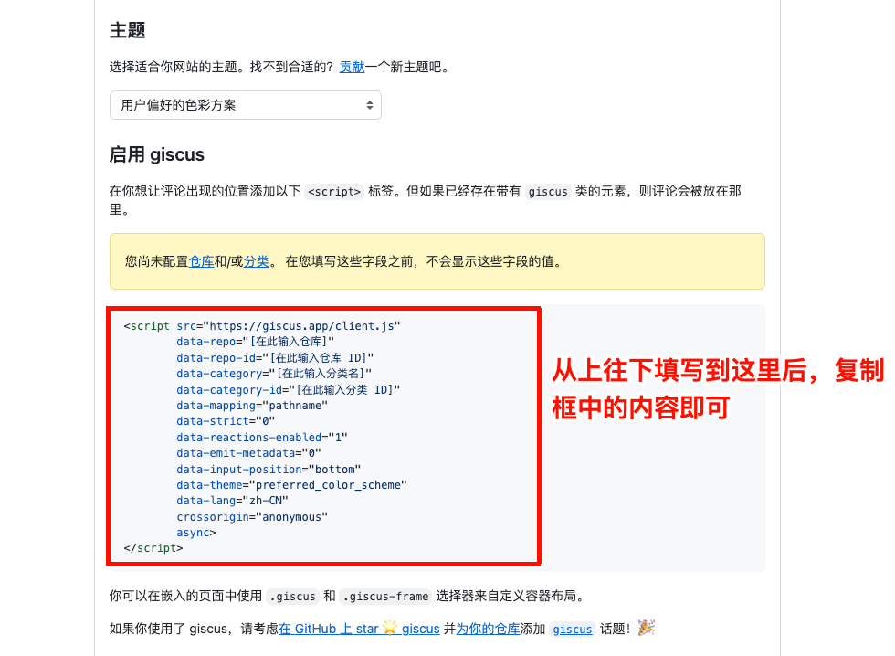
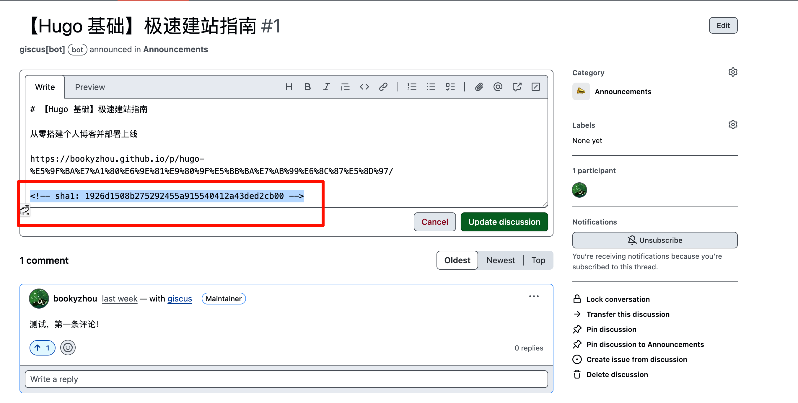

在这篇文章中，我们将介绍 **Giscus** 评论系统，并手把手教你将其集成到 Hugo 博客中。

## 为什么选择 Giscus？

Hugo 本身支持多种[评论系统](https://hugo.opendocs.io/content-management/comments/)（如 Disqus），而我们使用的 [Stack 主题](https://stack.jimmycai.com/zh/config/comments) 更是内置了对 DisqusJS、Waline、Utterances 等多种系统的支持。

在众多选择中，**Giscus** 脱颖而出，主要得益于它独特的实现方式——**基于 GitHub Discussions**。

### Giscus 的核心优势

- **开源免费**：无跟踪、无广告，永久免费。
- **GitHub 原生体验**：直接使用 GitHub 账号登录和评论，非常适合技术博客的受众。
- **无数据库负担**：所有评论数据直接存储在 GitHub Discussions 中，无需自行维护数据库。
- **功能完善**：支持 Markdown、表情符号、回复通知，甚至支持自定义主题。

### 工作原理

Giscus 的工作原理非常巧妙：

1. 它使用 **GitHub Discussions** 作为“数据库”来存储评论。
2. 当访客访问文章页面时，Giscus 插件会根据配置的**映射规则**（如文章标题、URL 等）在 GitHub 仓库中搜索对应的 Discussion。
3. 如果找到了，就加载评论；如果没找到，Giscus Bot 会在第一条评论产生时自动创建一个新的 Discussion。

## 部署指南

引入 Giscus 非常简单，只需四个步骤。

### 第一步：准备 GitHub 仓库

你需要确保博客源码所在仓库（例如 `bookyzhou.github.io`）是 **Public** 的，并进行相应配置。

1. 进入你的 GitHub 仓库页面。
2. 点击 **Settings** -> **General**。
3. 向下滚动找到 **Features** 区域，勾选 **Discussions**。



### 第二步：安装 Giscus App

为了让 Giscus 有权限在你的仓库中读取和写入评论，你需要安装 Giscus App。

1. 访问 [Giscus App 官方页面](https://github.com/apps/giscus)。
2. 点击 **Install**。
3. 选择你刚才准备好的仓库，点击 **Install** 确认。





### 第三步：获取配置参数

Giscus 官网提供了一个直观的配置生成器，能帮助我们快速生成所需的参数。

1. **访问官网**：前往 [Giscus 官网](https://giscus.app/zh-CN)。
2. **配置仓库**：输入你的仓库地址（例如 `bookyzhou/bookyzhou.github.io`）。
3. **选择映射关系**：推荐选择 **Discussion 标题包含页面标题** (`title`)。这样 Giscus 会根据文章标题自动查找或创建对应的评论区，生成的 Discussion 标题与文章一致，便于管理。
4. **选择 Discussion 分类**：推荐选择 `Announcements`。
5. **其他设置**：根据个人喜好配置即可。

配置完成后，页面下方会自动生成一段脚本代码和配置参数（如下图所示），我们可以将这段代码复制到自己博客的配置文件，嵌入到你的页面中。



### 第四步：集成到 Hugo (Stack 主题)

如果你使用的是 **Stack 主题**，恭喜你，集成工作将变得异常简单！该主题已内置了 Giscus 的支持代码（位于 `themes/hugo-theme-stack/layouts/partials/comments/provider/giscus.html`），你无需修改任何模板文件。

只需将上一步获取的参数填入博客的配置文件 `config/_default/params.yaml` 中即可。

打开配置文件，找到 `comments` 模块，参照下方示例进行修改（请务必使用你自己的 `repo` 和 `repoID`）：

```yaml
comments:
  enabled: true
  provider: giscus

  giscus:
    repo: bookyzhou/bookyzhou.github.io  # 替换为你的仓库地址
    repoID:                              # 替换为从官网获取的 data-repo-id
    category: Announcements              # 分类名称
    categoryID: DIC_kwDOQzDTWM4C10wv     # 分类 ID
    mapping: title                       # 映射规则，建议与官网配置保持一致
    strict: 1                            # 严格匹配模式
    reactionsEnabled: 1                  # 启用表情反应
    emitMetadata: 0
    inputPosition: top                   # 评论框位置：top (顶部) 或 bottom (底部)
    lightTheme: light                    # 亮色模式主题
    darkTheme: dark_dimmed               # 暗色模式主题（Stack 主题支持自动切换）
    lang: zh-CN                          # 语言设置
    loading: lazy                        # 懒加载
```

> **小提示**：Stack 主题支持根据系统设置自动切换 Giscus 的亮/暗主题，这在 `params.yaml` 中通过 `lightTheme` 和 `darkTheme` 进行配置。

## 评论迁移与映射机制

在使用过程中，你可能会遇到修改文章标题的情况。由于我们选择了 `title` 作为映射关系，修改标题会导致 Giscus 找不到原来的评论，从而创建一个新的 Discussion。

### 映射机制详解

Giscus 在寻找对应的 Discussion 时，实际上是根据映射关系生成一个**唯一的 Hash 值**，并将其存储在 Discussion 正文的隐藏区域中。

如下图所示，Discussion 正文中包含了一段 HTML 注释，其中记录了该 Discussion 对应的文章标识：



### 如何找回丢失的评论？

如果你修改了文章标题，想要找回之前的评论，只需手动更新 Discussion 中的标识即可：

1. **生成新标识**：在修改标题后的文章页面下，发布一条测试评论。Giscus 会自动创建一个新的 Discussion。
2. **获取 Hash**：前往 GitHub 仓库的 Discussions 列表，找到这个新创建的 Discussion，复制其正文中的 Hash 值（通常是一段隐藏的文本）。
3. **替换旧标识**：找到原本包含评论的旧 Discussion，编辑其正文，用新复制的 Hash 值替换掉旧的 Hash 值。
4. **清理**：删除第 1 步创建的那个临时 Discussion。

通过这种方式，你就可以将旧的评论区“迁移”到新标题的文章下了。

## 参考资料

- [Hugo 官方文档：评论系统](https://hugo.opendocs.io/content-management/comments/)
- [Stack 主题文档：评论配置](https://stack.jimmycai.com/zh/config/comments)
- [Giscus 官网](https://giscus.app/zh-CN)
