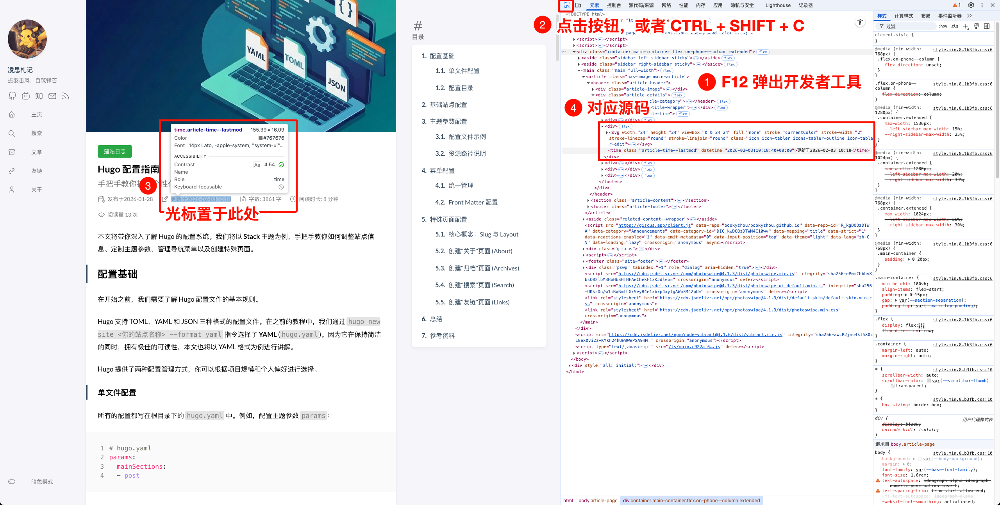

从这篇文章开始，我们将深入探索 **Hugo Stack** 主题的个性化配置。作为系列的第一篇，我们先来解决一个非常实用的需求：**自动获取并展示文章的最后更新时间**。

## 前置知识

在开始实现功能之前，我们需要先了解一些小技巧。这不仅能帮助我们更好地完成当前任务，也会为后续的主题定制打下基础。

### Hugo 的文件查找逻辑

Hugo 在构建站点时，遵循一套严格的文件查找规则。它会**优先**在项目根目录中查找文件（包括布局文件、静态资源、多语言配置等），只有当根目录中不存在对应文件时，才会去主题目录中查找。
例如，当 Hugo 需要构建文章页面的页脚时，它会按以下顺序查找文件：

1. **根目录**：`layouts/partials/article/components/footer.html`
2. **主题目录**：`themes/hugo-theme-stack/layouts/.../footer.html`

**这意味着什么？**

如果你对主题的某个部分不满意，你不需要直接修改 `themes` 目录下的文件（这会导致后续升级主题变得困难）。你只需要将该文件**复制**到根目录下的相同路径，然后进行修改。Hugo 就会优先使用你根目录下的文件，从而实现对主题样式的“重写”。

### 使用开发者工具快速定位文件

如果你想修改某个元素但不知道它对应哪个具体的文件，可以使用浏览器的开发者工具：

1. 按下 `F12` 打开开发者工具。
2. 点击左上角的小箭头图标（或按 `Shift + Ctrl + C`）。
3. 将鼠标悬停在你想要修改的元素上，即可在 Elements 面板中看到对应的源代码结构。



## 自动同步 Git 提交时间

默认情况下，我们需要手动在文章的 Front Matter 中修改 `lastmod` 字段来更新时间，这非常繁琐。既然我们的博客是托管在 Github 上的，为什么不直接利用 Git 的提交时间呢？

打开站点根目录下的 `hugo.yaml` 文件，添加以下配置：

```yaml
# hugo.yaml

# 启用 Git 信息功能
enableGitInfo: true 

# 配置 frontmatter 中 lastmod 的来源
frontmatter:
  lastmod:
    - ":git"     # 优先使用 Git 的最后一次提交时间
    - "lastmod"  # 如果 Git 信息不可用，则读取文章 Front Matter 中的 lastmod 字段
    - "date"     # 如果以上都没有，则回退到文章的创建时间 (date)
```

配置完成后，Hugo 就会自动读取每篇文章在 Git 历史中的最后一次 Commit 时间作为 `lastmod`。

## 定制展示位置与样式

有了数据，接下来我们来调整展示。

### 默认展示形式

Hugo Stack 主题默认支持展示更新时间，但它被放置在文章底部的页脚区域。相关代码位于 `layouts/partials/article/components/footer.html`：

```html
{{- if ne .Lastmod .Date -}}
<section class="article-lastmod">
    {{ partial "helper/icon" "clock" }}
    <span>
        {{ T "article.lastUpdatedOn" }} {{ .Lastmod | time.Format ( or .Site.Params.dateFormat.lastUpdated "Jan 02, 2006 15:04 MST" ) }}
    </span>
</section>
{{- end -}}
```

这段代码的逻辑是：如果**最后更新时间**与**创建时间**不一致，则显示时钟图标和更新时间。

### 移动到文章头部

为了让读者尽快确认文章的时效性，我们通常将最后更新时间移动到文章标题下方，与发布时间并列。

我们需要修改文件 `layouts/partials/article/components/details.html`。
请按照以下步骤操作：

1. 检查你的根目录下是否有 `layouts/partials/article/components/details.html` 文件。如果没有，请从 `themes/hugo-theme-stack/...` 目录复制一份过来。
2. 打开该文件，找到展示发布日期的代码块（通常包含 `article-time--published`）。
3. 在它下方插入以下代码：

```html
{{/* 插入到发布时间下方 */}}
{{- if ne .Lastmod .Date -}}
    <div>
        {{ partial "helper/icon" "edit" }}
        <time class="article-time--lastmod" datetime='{{ .Lastmod.Format "2006-01-02T15:04:05Z07:00" }}'>
            {{ T "article.lastUpdatedOn" }} {{ .Lastmod | time.Format ( or .Site.Params.dateFormat.lastUpdated "Jan 02, 2006 15:04 MST" ) }}
        </time>
    </div>
{{- end -}}
```

这里我们将图标从默认的 `clock`改为了 `edit`，语义更加准确。你可以根据喜好在 `assets/icons` 目录下查找其他可用图标。

此外，如果你想修改“最后更新于”这段文字（例如改为“更新时间：”），可以通过修改 `i18n/zh-cn.yaml` 文件中的 `article.lastUpdatedOn` 字段来实现。

## 常见问题与修复

在实际部署中，你可能会遇到一些问题。

### 所有文章的更新时间都变成了“最后一次提交时间”？

**现象**：部署到服务器（如 GitHub Pages）后，发现所有文章的更新时间都显示为**最后一次提交的时间**（即触发本次构建的那次提交），导致很多未修改的老文章时间也被更新了。

**原因**：GitHub Actions 等 CI/CD 工具为了加快速度，默认只拉取最近一次 commit（浅克隆），导致 Hugo 无法获取完整的 Git 历史记录。详情可参考 Hugo 官方文档的 [相关说明](https://gohugo.io/methods/page/gitinfo/#hosting-considerations) 。

**解决方案**：
修改 `.github/workflows/hugo.yaml` 文件，在 `Checkout` 步骤中将 `fetch-depth` 设置为 `0`（表示拉取完整历史）：

```yaml
steps:
  - name: Checkout
    uses: actions/checkout@v4
    with:
      submodules: recursive
      fetch-depth: 0  # 关键：获取完整的 Git 历史记录
```

*注意：这会增加构建时间，但对于博客仓库来说通常是可以接受的。*

### 中文文件名的文章无法获取 Git 信息？

**现象**：英文文件名的文章能正常显示更新时间，但中文文件名的文章却无法获取 Git 提交时间。

**原因**：Git 默认会对大于 0x80 字节的字符（如中文）进行转义（例如显示为 `\302\265`），导致 Hugo 无法通过文件名匹配到 Git 记录。

**解决方案**：

我们需要关闭 Git 的[路径转义功能](https://git-scm.com/docs/git-config#Documentation/git-config.txt-corequotePath)，让 Git 保留文件名的原始形式。

**本地修复**（用于本地预览）：

如果你想在本地预览时看到正确的更新时间，执行以下命令：

```bash
git config --global core.quotePath false
```

配置完成后，只需在本地提交一次 commit（无需推送到远程），然后运行 `hugo server`，就能看到中文文件名文章的更新时间了。

**CI/CD 修复**（用于线上部署）：

打开 `.github/workflows/hugo.yaml` 文件，在 Checkout 步骤之后添加以下配置：

```yaml
jobs:
  build:
    steps:
      # ... Checkout 步骤 ... 
      - name: Configure Git
        run: git config --global core.quotePath false
```

## 参考资料

- [GitInfo | Hugo官方文档](https://gohugo.io/methods/page/gitinfo/)
- [解决Hugo文章路径含中文时无法获取GitInfo的问题](https://ray233.pages.dev/hugo-gitinfo-from-chinese-path-posts/)
