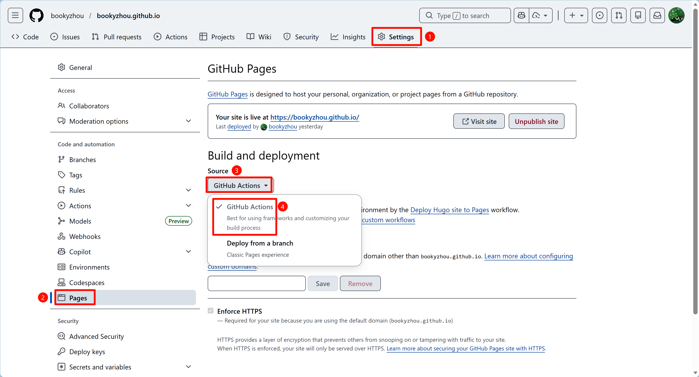

通过这篇指南，你将快速掌握 Hugo 的安装与基本建站流程，轻松拥有一个属于自己的个人博客。

## 准备工作

在安装 Hugo 之前，请确保你的系统已安装以下两款核心工具：[Git](https://git-scm.com/) 和 [Go](https://go.dev/)。Git 主要用于主题管理以及部署工作，而 Go 则是 Hugo 构建和模块管理的基础。

你可以通过在终端运行以下命令来验证它们是否已安装，并检查版本：
```bash
git --version
go version
```
如果命令能正确返回版本信息，说明你已经准备就绪！

## 安装 Hugo

为了让大家少走弯路，这里我将重点介绍安装 Hugo 的关键步骤。如果你需要更详细或针对特定操作系统的安装说明，建议参考[Hugo 官方文档](https://gohugo.io/installation/)，那里有最权威、最完整的安装流程。

以 Linux 系统为例，使用 Snap 包管理器进行安装，在 Linux 终端中执行以下命令：
```bash
sudo snap install hugo --channel=extended/stable
```
**小提示：** Hugo 提供了标准版和扩展版两个版本。扩展版内置了 LibSass 转译器，能够将 Sass 语言转换为 CSS。很多现代 Hugo 主题都会用到这一功能，为了确保主题兼容性和丰富的功能体验，请确保你安装的是扩展版。

安装完成后，你可以通过运行以下命令来检查 Hugo 的版本：
```bash
hugo version
```

如果一切顺利，你应该会看到类似下面的输出（版本号可能不同，需要确认 `extended` 关键词）：
```bash
hugo v0.152.2-6abdacad3f3fe944ea42177844469139e81feda6+extended linux/amd64 BuildDate=2025-10-24T15:31:49Z VendorInfo=snap:0.152.2
```

## Hugo 建站

现在 Hugo 已经安装完毕，是时候迈出搭建个人博客的第一步了！

### 新建项目

首先，在你的终端中输入以下命令，创建一个全新的 Hugo 站点项目：
```bash
hugo new site <你的站点名称> --format yaml
```

将 `<你的站点名称>` 替换为你希望的项目文件夹名，例如 `my-blog`。运行后，Hugo 会自动创建一个同名文件夹，其中包含了博客的基本目录结构：
```
.
├── archetypes      # 文章模板存放地
├── assets          # 全局资源文件（可进行管道处理）
├── content         # 网站的核心内容，如文章、页面等
├── data            # 存放自定义数据文件
├── i18n            # 多语言站点翻译文件
├── layouts         # 定义网站页面布局的模板文件
├── static          # 存放图片、CSS、JS 等静态资源
├── themes          # 存放你选择的 Hugo 主题
└── hugo.yaml       # 整个站点的核心配置文件
```

至此，一个博客的基本框架就已经搭建好了，接下来我们就要为它穿上漂亮的“外衣”——导入主题！

### 导入主题

Hugo 拥有一个庞大而活跃的主题社区。你可以访问 [Hugo Themes](https://themes.gohugo.io/) 官网，浏览并选择一个你喜欢的主题。请注意，每个主题的安装和配置方式可能略有不同，建议大家仔细阅读所选主题的官方安装教程。

这里，博主将以自己使用的 [Stack](https://github.com/CaiJimmy/hugo-theme-stack) 主题为例，演示如何通过 `git submodule` 的方式进行安装：

首先，进入你刚创建的站点目录：
```bash
cd <你的站点名称>
```

如果你的项目目录还不是一个 Git 仓库，需要先进行初始化：
```bash
git init
```

然后，使用 `git submodule` 命令将 Stack 主题添加到 `themes` 文件夹中：
```bash
git submodule add --depth=1 https://github.com/CaiJimmy/hugo-theme-stack/ themes/hugo-theme-stack
```

最后，在你的站点根目录下的 `hugo.yaml` 配置文件中，指定你希望使用的主题：
```yaml
# hugo.yaml
theme: 'hugo-theme-stack'
```

保存 `hugo.yaml` 文件，恭喜你，主题导入工作已全部完成！

### 配置与构建

在正式构建和发布站点之前，为了更直观地了解和配置主题，我们可以先使用 Stack 主题提供的示例配置文件和内容。这样做的好处是能够立即看到各种配置项的效果，后续根据自己的需求进行修改时也会方便很多。

依然在你的站点根目录中，执行以下命令：
```bash
cd <你的站点名称>
cp ./themes/hugo-theme-stack/exampleSite/hugo.yaml ./hugo.yaml
cp -r ./themes/hugo-theme-stack/exampleSite/content ./
```
**小提示：** 第二条命令会将示例内容复制到你的 `content` 文件夹中，如果你已经创建了内容，请注意备份或合并。

现在，是时候构建你的站点了！在项目根目录运行 `hugo` 命令：
```bash
hugo
```

`hugo` 命令会编译你的站点所有内容和模板，并将生成的静态文件发布到项目根目录下的 `public` 文件夹中。同时，它通常还会创建一个 `resources` 目录，用于存放管道处理后的缓存输出，例如优化过的 CSS 和图片。

### 本地预览网页

构建完成后，我们可以在本地启动一个服务器来预览你的博客。在项目目录执行下方命令：
```bash
hugo server
```

默认情况下，Web 服务器将在 [http://localhost:1313/](http://localhost:1313/) 启动。在你的浏览器中访问这个地址，就能看到你的博客啦！

`hugo server` 的一个强大之处在于其内置的 LiveReload 功能。服务器运行期间，如果你修改了源文件（例如文章内容、模板文件、配置文件等），它会立即检测到改动，自动重新构建站点，并刷新你的浏览器页面。这意味着你可以实时预览你对博客的每一次改动，极大地提升了开发效率！

**小提示：** 极少数情况下，如果浏览器缓存导致改动未显示，你可以尝试使用 `Ctrl+F5` 强制刷新页面数据。

### 创建你的第一篇文章

Hugo 中的文章内容采用 Markdown 格式编写，非常简洁高效。你可以使用以下命令来创建一篇新文章：
```bash
hugo new post/my_first_article.md
```

这条命令会在 `./content/post` 路径下创建一个名为 `my_first_article.md` 的文件。当你打开这个文件时，你会发现文件中已经预先填写了一些内容（通常是 YAML Front Matter），这部分内容实际上是由 `archetypes/default.md` 中的模板生成的，你可以修改模板文件进行配置。

至此，你已经成功地搭建了一个可以在本地访问的 Hugo 博客，并学会了如何创建文章。接下来，我们将探讨如何将这个博客部署到线上，让全世界都能看到它！

## 部署到 Github Pages

通过将 Hugo 站点部署到 GitHub Pages，并配合 GitHub Actions 自动化部署流程，你将拥有一个高效、稳定且易于维护的个人博客。
如果你想深入了解更多细节，可以参考 [关于 GitHub Pages 的托管指南](https://gohugo.io/hosting-and-deployment/hosting-on-github/)。

### 创建网站仓库

首先，登录你的 GitHub 账号，并新建一个仓库。将仓库的名称设置为 `你的用户名.github.io`，并且把仓库可见性设置为 Public。

### 将本地项目链接到远程仓库

创建好远程仓库后，我们需要将本地的 Hugo 项目链接到这个新创建的 GitHub 仓库。

首先，确保你当前的工作目录是你的 Hugo 站点的根目录。然后，执行以下 Git 命令：
```
# 将本地仓库与远程仓库关联
git remote add origin https://github.com/<你的用户名>/<你的用户名>.github.io.git
# 将当前分支重命名为 main (如果默认不是main的话)
git branch -M main
# 添加所有文件到暂存区
git add .
# 提交你的更改
git commit -m "feat: first commit of Hugo site"
# 推送你的更改到远程仓库，并设置上游分支
git push --set-upstream origin main
```

### 配置 Github Pages 设置

代码推送完成后，前往你的 GitHub 仓库页面，进行关键的 Pages 设置：

1. 点击导航栏顶部的 `Settings` 选项卡。
2. 在左侧侧边栏中，向下滚动并找到并点击 `Pages`。
3. 在 `Build and deployment` 部分，将 `Source` 选项从 `Deploy from a branch` 改为 `GitHub Actions`。



### 新增 GitHub Actions 部署工作流文件
现在，我们来添加一个 GitHub Actions 配置文件。这个文件将定义一个自动化工作流，负责在每次你推送到 `main` 分支时，自动构建你的 Hugo 站点并将其部署到 GitHub Pages。

在你的 Hugo 站点根目录下，创建一个名为 `.github/workflows` 的新文件夹。然后，在这个文件夹中创建一个名为 `hugo.yaml` 的文件。

将以下内容复制粘贴到 **`.github/workflows/hugo.yaml`** 文件中（注意调整 `HUGO_VERSION`）：
```
name: Deploy Hugo site to Pages

on:
  # 在 main 分支有代码推送时触发
  push:
    branches:
      - main
  workflow_dispatch:

# 设置 Github Pages 所需权限
permissions:
  contents: read
  pages: write
  id-token: write

# 设置并发策略
concurrency:
  group: "pages"
  cancel-in-progress: false

# 默认使用 bash
defaults:
  run:
    shell: bash

jobs:
  # 构建作业
  build:
    runs-on: ubuntu-latest
    env:
      # 请根据你实际的 Hugo 版本进行调整
      HUGO_VERSION: 0.152.2
    steps:
      - name: Checkout
        uses: actions/checkout@v4
        with:
          submodules: recursive
          fetch-depth: 0

      - name: Setup Hugo
        uses: peaceiris/actions-hugo@v3
        with:
          hugo-version: ${{ env.HUGO_VERSION }}
          extended: true

      - name: Setup Pages
        id: pages
        uses: actions/configure-pages@v5

      - name: Install Node.js dependencies
        run: "[[ -f package-lock.json || -f npm-shrinkwrap.json ]] && npm ci || true"

      - name: Build with Hugo
        env:
          HUGO_ENVIRONMENT: production
          HUGO_ENV: production
        run: |
          hugo \
            --gc \
            --minify \
            --baseURL "${{ steps.pages.outputs.base_url }}/"

      - name: Upload artifact
        uses: actions/upload-pages-artifact@v3
        with:
          path: ./public

  deploy:
    environment:
      name: github-pages
      url: ${{ steps.deployment.outputs.page_url }}
    runs-on: ubuntu-latest
    needs: build
    steps:
      - name: Deploy to GitHub Pages
        id: deployment
        uses: actions/deploy-pages@v4
```

### 推送工作流文件并观察部署
保存 `hugo.yaml` 文件后，将其提交并推送到 GitHub：
```
git add .github/workflows/hugo.yaml
git commit -m "feat: Add GitHub Actions workflow for Hugo deployment"
git push
```

推送成功后，导航到你的 GitHub 仓库的 `Actions` (动作) 标签页。你会看到一个名为 "Deploy Hugo site to Pages" 的工作流正在运行。点击它，你可以查看其执行进度和详细日志。


一旦工作流成功完成，通常需要等待几分钟（GitHub Pages 的部署可能有一些延迟），你的博客就应该可以通过 `https://你的用户名.github.io` 访问了！

## 参考资料

- [入门指南 | Hugo官方文档](https://hugo.opendocs.io/getting-started/)
- [Getting Started | Stack](https://stack.jimmycai.com/guide/getting-started)